- Editor: [Daniel Beeke](mailto:mail@danielbeeke.nl)
- Last edit: May 5, 2023
- Status: In development

A technology specification and RDF ontology for having server driven UIs of RDF data specific per frontend on top of the [SHACL](https://www.w3.org/TR/shacl/) and [DASH](https://datashapes.org/forms.html) vocabularies.

## Introduction

Creating apps and websites can be tedious. Re-use of visual building blocks makes for a faster development phase. Re-using how things look would help developers to mostly focus on the business logic. 

SHACL is an excellent way to have portable data constraints. Similar to how a relation database has database constraints, a SHACL shape is a set of constraints on a specific type of RDF data.

DASH builds on top of this and enables us to have forms rendered from SHACL shapes. Another part that DASH has are dash:viewers. These dash:viewers can show data depending on configuration and the actual types of the data. It is resiliant, the data may be entered incorrectly but it would still display.

The ViewMode specification aims to bridge the gap from SHACL and DASH to a workable implementation that supports different frontends to gather the available dash:editors and dash:viewers from, have viewers without an sh:path.

Another part that needs bridging is a way of glueing it all together. This specification also will propose an editor for SHACL shapes to create SHACL ViewModes (a SHACL shape focused on the dash:viewers).

## Concrete missing parts in SHACL and DASH

Predicates for:

- Specifying which frontend to connect to, to gather dash:editors and dash:viewers
- Passing configurables from the dash:editors and dash:viewers, will these be mini SHACL shapes?
- Layouts that are tied to sh:group

## General idea



You will have at least one SHACL shape for your form and render that with a SHACL form renderer. Another SHACL shape that is aimed at displaying, will be made. This shape must also be a vm:ViewMode. To make these SHACL shapes a visual administrative interface for creating and editing these shapes would be great.

Parts:

- SHACL form renderder (not part of this spec, an initiative is starting inside the [rdfjs/public Gitter group](https://app.gitter.im/#/room/#rdfjs_public:gitter.im))
- SHACL ViewMode editor
- SHACL ViewMode renderer

## What is a SHACL ViewMode?

A SHACL ViewMode is an ordinary SHACL shape but it does not have dash:editor predicates. It also does not have SHACL properties it does not want to display. It may have dash:viewer predicates. It is only focused on displaying the data versus creating and editing.

### Why would we need a seperate document / shape for viewing?

A SHACL ViewMode might not display all the SHACL properties that a form has. 

## What is a SHACL (ViewMode) editor?

A SHACL ViewMode editor is a visual user interface for a developer or system administrator to create a SHACL shape. This editor can be used both for creating standard SHACL shapes for the purpose of validation or forms and it can be used to create SHACL ViewModes.

This editor could be a visual editor where you can make nested layouts with sh:group predicates. And it can connect to a frontend and request all the available dash:editors and dash:viewers and their vm:configurables.

## What is a SHACL ViewMode renderer?

A SHACL ViewMode renderer, renders the given SHACL ViewMode in HTML or in any other language / system. The SHACL ViewMode renderder is also responsible to transfer the available dash:editors and dash:viewers and their configurables to the SHACL (ViewMode) editor.

## Example of a SHACL ViewMode

```turtle
@prefix frontend: <https://example.com/> .
@prefix dash: <http://datashapes.org/dash#> .
@prefix shacl: <http://www.w3.org/ns/shacl#> .
@prefix vm: <https://viewmode.dev/ontology#> .

ex:PersonShapeViewMode
	a sh:NodeShape, vm:ViewMode ;
	sh:targetClass ex:Person ;
	sh:shapesGraph ex:PersonShape ;

	vm:interface (
		<http://localhost:3000/viewmode.ttl>, 
		<https://example.com/viewmode.ttl>
	) ;

	sh:property [
		sh:path ex:name ;
		sh:maxCount 1 ;
		sh:datatype xsd:string ;
	] ;

	sh:property [
		sh:path ex:ssn ;
		sh:maxCount 1 ;
		sh:datatype xsd:string ;
    sh:viewer frontend:ssn ;
	] ;

	sh:property [
		sh:path ex:ssn ;
		sh:maxCount 1 ;
		sh:datatype xsd:string ;
    sh:viewer frontend:ssn ;
	] ;

	sh:property [
		sh:path ex:worksFor ;
		sh:class ex:Company ;
		sh:nodeKind sh:IRI ;
    sh:viewer [
      vm:nestedViewMode ex:CompanyShapeViewMode ;
    ] ;
	]
.

```

## Example of the data that is transfered between the frontend and the SHACL editor

http://localhost:3000/viewmode.ttl

```turtle
@prefix frontend: <https://example.com/> .
@prefix dash: <http://datashapes.org/dash#> .
@prefix shacl: <http://www.w3.org/ns/shacl#> .
@prefix vm: <https://viewmode.dev/ontology#> .

frontend:ssn a dash:SingleViewer ;
  rdfs:label "SSN label" ;
  sh:node frontend:labelConfigurableShape, frontend:ssnConfigurableShape .

frontend:ssnConfigurableShape a sh:NodeShape ;
  sh:property [
		sh:path frontend:showDashes ;
		sh:maxCount 1 ;
		sh:datatype xsd:boolean ;
	] .

vm:nestedViewMode a dash:SingleViewer ;
  rdfs:label "Nested ViewMode" .
  sh:node frontend:nestedViewModeConfigurableShape .

frontend:nestedViewModeConfigurableShape a sh:NodeShape ;
  sh:property [
		sh:path vm:showLabel ;
		sh:maxCount 1 ;
		sh:datatype xsd:boolean ;
	] .

frontend:labelConfigurableShape a sh:NodeShape ;
  sh:property [
		sh:path rdfs:label ;
		sh:datatype sh:stringOrLangString ;
	] ;

  sh:property [
		sh:path vm:showLabel ;
		sh:maxCount 1 ;
		sh:datatype xsd:boolean ;
	] ;
  .


```
